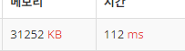
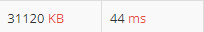

# [Bronze II] 수 정렬하기 - 2750 

[문제 링크](https://www.acmicpc.net/problem/2750) 

### 성능 요약

메모리: 31120 KB, 시간: 100 ms

### 분류

정렬, 구현

### 제출 일자

2024년 3월 20일 15:26:41

### 문제 설명

<p>N개의 수가 주어졌을 때, 이를 오름차순으로 정렬하는 프로그램을 작성하시오.</p>

### 입력 

 <p>첫째 줄에 수의 개수 N(1 ≤ N ≤ 1,000)이 주어진다. 둘째 줄부터 N개의 줄에는 수가 주어진다. 이 수는 절댓값이 1,000보다 작거나 같은 정수이다. 수는 중복되지 않는다.</p>

### 출력 

 <p>첫째 줄부터 N개의 줄에 오름차순으로 정렬한 결과를 한 줄에 하나씩 출력한다.</p>

### 선택정렬 구현
```py
from sys import stdin as s
#s = open("input.txt")
N = int(s.readline())
min_num = 1000
arr = [int(s.readline()) for i in range(N)]
for i in range(N):
    for j in range(i,N):
        if min_num > arr[j]:
            min_num = arr[j]
    arr[arr.index(min_num)] = arr[i]
    arr[i] = min_num
    min_num = 1000
answer = ""
for i in arr:
    print(i)
```
  
시간복잡도 (n^2)

### sort함수 사용
```py
from sys import stdin as s
#s = open("input.txt")
N = int(s.readline())
print(*sorted([int(s.readline()) for i in range(N)]), sep="\n")
```
  
시간복잡도(nlogn)
파이썬의 sort,sorted는 Timsort를 