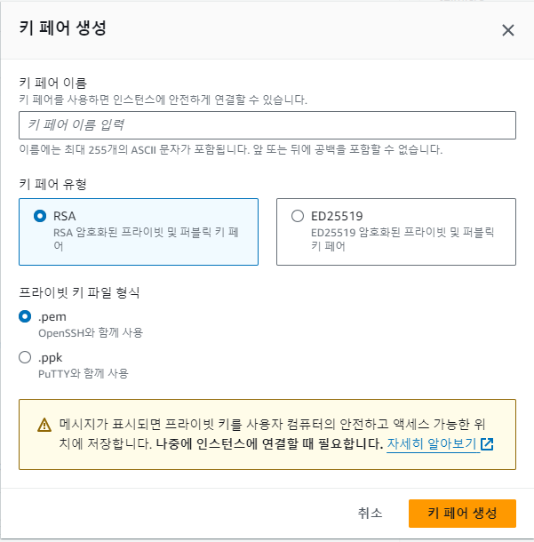

거래사이트를 개발 중에 테스트 API를 배포하기 위해서 ec2의 서버를 이용할 필요가 있게 되었다.

aws프리티어를 적극 이용하였다.
```
프리 티어: In your first year includes 750 hours of t2.micro (or t3.micro in the Regions in which t2.micro is unavailable) instance usage on free tier AMIs per month, 750 hours of public IPv4 address usage per month, 30 GiB of EBS storage, 2 million IOs, 1 GB of snapshots, and 100 GB of bandwidth to the internet.
```


이후 ssh로 원격 제어하기 위해 키를 생성하였다.  


인스턴스를 생성 한 이후 MobaXterm 클라이언트를 이용해 ssh접근을 시도하였다.


## ssh 시도 실패
```cmd
No supported authentication methods available (server sent: publickey)
```
### 해결
리눅스 계열의 경우 원격 접속할때 디폴트 값인 `ubuntu`으로 Specify username을 지정해줘야 한다.

## 환경 설정 및 설치
기존의 스프링부트 환경에 맞춰 버전을 설치한다. 여기서는 17버전을 사용하였다.
```
$ sudo apt update
$ sudo apt install openjdk-17-jdk -y

$ sudo -version // 설치 후 버전 확인
```

## SSH를 이용한 github clone 하기
예전에는 아이디 비밀번호로 되었던걸로 기억하는데 이번에는 deprecated 되어 사용하지 못한다고 하여 ssh를 이용하기로 하였다.

터미널에서 깃허브 권한을 위한 ssh key를 생성.
```cmd
$ cd ~/.ssh
$ ssh-keygen -t rsa -C {github 이메일 혹은 닉네임}
$ cat id_rsa.pub
```

이후 키를 복사해서 깃허브 세팅 - access에서 잘 찾아서 ssh key를 추가하였다.


```
$ git clone git@github.com:username/repository.git
```

이후 레포지토리 폴더가 생성되면 cd 명령어로 이동해보자.
만약 폴더 이름이 길다면 조건식을 통해 특정한 디렉토리로 바로 접근도 할 수 있다.
```
$ cd $(ls -d */ | head -n 1)
```

## 깃 브랜치 이동 후 빌드하기
현재 main보다 기능단위로 브랜치를 운영중이여서 특정 브랜치 환경에서 테스트 배포 하기위해 아래처럼 진행하였다.


```
$ git fetch --all

// 로컬에서 브랜치를 같은 브랜치를 미리 만들고 원격 브랜치를 연결
$ git checkout -b <원격 브랜치 이름> origin/<원격 브랜치 이름>

$ git branch -a  // 원격 저장소의 브랜치를 확인할 수 있다.
```

```
chmod +x gradlew // 빌드하기 위해 권한을 부여하고
./gradlew clean build // 빌드
```


```
sudo java -jar TradingMatchingService-0.0.1-SNAPSHOT.jar
```
빌드 후 실행하면 끝

이후 RDS를 ec2에 연결하고 테스트 배포까지 포스팅할 예정이다.