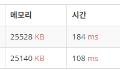

# [Silver IV] 나는야 포켓몬 마스터 이다솜 - 1620 

[문제 링크](https://www.acmicpc.net/problem/1620) 

### 성능 요약

메모리: 25140 KB, 시간: 108 ms

### 분류

자료 구조, 해시를 사용한 집합과 맵

### 제출 일자

2024년 8월 29일 00:29:14

### 입력 

 <p>첫째 줄에는 도감에 수록되어 있는 포켓몬의 개수 N이랑 내가 맞춰야 하는 문제의 개수 M이 주어져. N과 M은 1보다 크거나 같고, 100,000보다 작거나 같은 자연수인데, 자연수가 뭔지는 알지? 모르면 물어봐도 괜찮아. 나는 언제든지 질문에 답해줄 준비가 되어있어.</p>

<p>둘째 줄부터 N개의 줄에 포켓몬의 번호가 1번인 포켓몬부터 N번에 해당하는 포켓몬까지 한 줄에 하나씩 입력으로 들어와. 포켓몬의 이름은 모두 영어로만 이루어져있고, 또, 음... 첫 글자만 대문자이고, 나머지 문자는 소문자로만 이루어져 있어. 아참! 일부 포켓몬은 마지막 문자만 대문자일 수도 있어. 포켓몬 이름의 최대 길이는 20, 최소 길이는 2야. 그 다음 줄부터 총 M개의 줄에 내가 맞춰야하는 문제가 입력으로 들어와. 문제가 알파벳으로만 들어오면 포켓몬 번호를 말해야 하고, 숫자로만 들어오면, 포켓몬 번호에 해당하는 문자를 출력해야해. 입력으로 들어오는 숫자는 반드시 1보다 크거나 같고, N보다 작거나 같고, 입력으로 들어오는 문자는 반드시 도감에 있는 포켓몬의 이름만 주어져. 그럼 화이팅!!!</p>

### 출력 

 <p>첫째 줄부터 차례대로 M개의 줄에 각각의 문제에 대한 답을 말해줬으면 좋겠어!!!. 입력으로 숫자가 들어왔다면 그 숫자에 해당하는 포켓몬의 이름을, 문자가 들어왔으면 그 포켓몬의 이름에 해당하는 번호를 출력하면 돼. 그럼 땡큐~</p>

<p></p>

<p>이게 오박사님이 나에게 새로 주시려고 하는 도감이야. 너무 가지고 싶다ㅠㅜ. 꼭 만점을 받아줬으면 좋겠어!! 파이팅!!!</p>

### 제출 코드
```cpp
#define _CRT_SECURE_NO_WARNINGS
#include <iostream>
#include <string>
#include <unordered_map>
using namespace std;

int N, M;
unordered_map<int, string> IntToString;
unordered_map<string, int> StringToInt;

int main() {
	freopen("input.txt", "r", stdin);
	ios_base::sync_with_stdio(false);
	cin.tie(0);

	cin >> N >> M;

	for (int i = 1; i < N+1; i++)
	{
		string s;
		cin >> s;

		IntToString[i] = s;
		StringToInt[s] = i;
	}

	for (int i = 0; i < M; i++)
	{
		string w;
		cin >> w;
		
		// 숫자이면
		if (isdigit(w[0])) {
			int n = stoi(w);
			cout << IntToString[n] << "\n";
		}
		// 문자이면 
		else if (isalpha(w[0])) {
			cout << StringToInt[w] << "\n";
		}
	}
	return 0;
}
```

### unordered map을 사용한 이유

위가 map 아래가 unordered map의 결과이다.

map을 이진 검색 트리로 검색연산을 할때 O(log n)의 시간이 걸린다.
반면 unordered map는 해시 테이블을 사용하므로 해시 충돌로 인해 꼬이지 않는다면 검색에 O(1)의 시간을 수행하므로 선택하였다. 

위 문제의 경우는 어차피 스트링과 인트형 둘다 검색 대상이기에 맵이 두개가 사용된다. 따라서 굳이 순서가 보장되는 map을 사용하지않고 순서 상관없지만 속도가 빠른 unordered map을 사용하게 되었다.

요약하자면 빠른 접근만이 필요하다면 unordered map이 효율적이다!

### 해결 과정
도감을 만든다. N만큼. 다만, 검색 시 string, int형 둘다 검색이 가능하여야 하기 때문에 

unordered_map<int, string> IntToString;
unordered_map<string, int> StringToInt;

두가지 맵을 사용해 도감을 만들어주었다. 일명 int로 검색되는 도감, string으로 검색되는 도감.
그 후에 string으로 M만큼 받는데 각각 숫자일땐 형변환을 통해 검색하고 문자열일땐 그대로 연산해주어 해결하였다.
