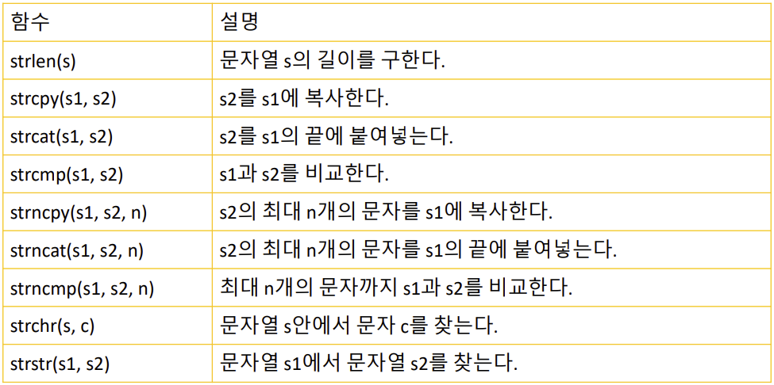

## 동적 메모리
- 실행 도중 동적으로 메모리를 할당받는것
- 종료시 시스템에 메모리 반납
- 필요한만큼의 메모리 효율적 사용
- new, delete 키워드 사용

### malloc(), free()
```cpp
#include <iostream>
using namespace std;

int main() {
	const int MAX_SIZE = 100;
	int* pi;

	pi = (int*)malloc(MAX_SIZE * sizeof(int));
	for (int i = 0; i < MAX_SIZE; i++)
		*pi = 0;
	free(pi);
	return 0;
}
```
### new, delete 사용
```cpp
#include <iostream>
using namespace std;

int main() {
	const int MAX_SIZE = 100;
	int* pi;

	pi = new int[MAX_SIZE];
	for (int i = 0; i < MAX_SIZE; i++)
		*(pi+1) = 0;
	delete[] pi;
	return 0;
}
```
맞는 메소드를 쌍으로 사용하자

```cpp
int *pi = new int; // 하나의 int형 공간할당
int *pia = new int[100]; // 크기가 100인 int형 동적배열할당
double *pd = new double; // 하나의 double형 공간할당
double *pda = new double[100]; // 크기가 100인 double형 동적배열할당
```

## 참조자(Reference)
- 변수에 별명을 붙이는 것
	- 변수 선언 후 참조자 선언
		```
		int var = 10 ;
		int &ref = var;
		```
- &기호 사용
	- 변수의 주소를 반환하는 연산자와 다르다.
- 참조자에 값을 대입
	- 참조하는 변수의 값이 변경된다.
		```
		ref = 20 // 변수 var의 값이 20으로 변경
		```


### 참조자와 포인터를 따로 사용하는 이유
```
C++에서 참조자와 포인터를 따로 사용하는 이유는 여러 가지가 있습니다.

편의성과 가독성: 참조자는 별명처럼 원본 변수에 대한 별칭을 제공하므로 코드를 더 직관적으로 만들어 줍니다. 예를 들어 함수 인자로 전달할 때 포인터보다 참조자를 사용하면 더 명확하고 간결한 코드를 작성할 수 있습니다.

안전성: 참조자는 포인터와 달리 널 포인터를 가리킬 수 없으므로 널 포인터로 인한 에러를 방지할 수 있습니다.

초기화: 참조자는 선언될 때 반드시 초기화되어야 하므로 초기화되지 않은 참조자를 사용하는 실수를 방지할 수 있습니다.

객체 지향 프로그래밍: 참조자는 객체 지향 프로그래밍에서 많이 활용되는데, 이는 객체 간의 상호 작용을 표현하는 데 유용합니다. 객체를 참조로 전달하면 객체의 복사본을 만들지 않고도 객체를 직접 조작할 수 있습니다.
```

### 참조자가 선언될때 메모리를 차지할까?
```
참조자는 단순히 기존 변수에 대한 별칭(alias)을 제공합니다. 따라서 참조자를 선언하면 해당 변수와 동일한 메모리 위치를 가리키게 됩니다. 즉, 참조자는 실제로는 메모리를 차지하지 않고, 해당 변수의 별명(alias)으로 작용합니다.
```

```cpp
#include <iostream>
using namespace std;
int main() 
{ 
int var;
int &ref = var; // 참조자 선언
var = 10;
cout << "var의 값: " << var << endl;
cout << "ref의 값: " << ref << endl;
ref = 20; // ref의 값을 변경하면 var의 값도 변경된다. 
cout << "var의 값: " << var << endl;
cout << "ref의 값: " << ref << endl;
return 0;
}
```
```cpp
var의 값: 10
ref의 값: 10
var의 값: 20
ref의 값: 20
```

### 참조자와 포인터의 차이
- 참조자는 __반드시__ 선언과 동시에 초기화
- 포인터는 변경이 가능, 참조자는 불가능하다.
- 상수로 초기화시 컴파일 오류

- 참조자는 null이 될 수 없기에,  null 가능성이 있을 경우 포인터를 사용
- 참조자는 참조 대상을 변경할 수 없기에, 참조 대상이 수시로 변할거 같다면, 포인터를 사용

### 참조자의 용도
- 함수 호출시 매개 변수와 반환값으로 사용

- 매개변수
```cpp
#include <iostream>
using namespace std;

void dec_by_r(int& r) { // r은 time의 참조자이다.
	r--; // time이 감소된다. 
	return;
}
void dec_by_p(int* p) {
	--(*p); // time이 감소된다. 
	return;
}
int main()
{
	int time = 10;
	dec_by_r(time); // time을 전달한다. 
	dec_by_p(&time); // time의 주소를 전달한다.
	return 0;
}
```
- 함수 반환
	- 지역 변수의 참조자를 반환하면 안된다.
		```cpp
		int& sub() {
			int n = 0;
			return n; // 오류! → n은 지역 변수
		}
		```
	- 함수가 반환되도 존재하는 변수를 반환하는 예
		```cpp
		int& findMax(int arr[], int size) {
			int maxIndex = 0;
			for (int i = 1; i < size; ++i) {
				if (arr[i] > arr[maxIndex]) {
					maxIndex = i;
				}
			}
			return arr[maxIndex];
		}
		```

- const 참조자  
	- 상수를 매개 변수로 받는 경우에 필요
		- 참조자를 통한 변경을 방지하기 위해. (읽기전용)
		```cpp
		void print(const int& r)
		{
			cout << "현재의 값= " << r << endl;
			return;
		}
		int main()
		{
			print(100);
			return 0;
		}
		```
### 함수 호출시 인수 전달 방식
- 값에 의한 호출 (call by value)
	- 함수로 복사본이 전달. 원본에 영향x

- 참조에 의한 호출 (call by reference)
	- 함수로 원본이 전달.

### 참조에 의한 호출
- 포인터
	```cpp
	int main(){
		int a = 100, b = 200;
		swap(&a,&b);
		...
	}

	void swap(int *px, int *py) ...
	```

- 참조자
	```cpp
	int main(){
		int a = 100, b = 200;
		swap(a,b);
		...
	}

	void swap(int &px, int &py) ...
	```		

### 문자배열
- 문자 배열 원소들을 중괄호 안에 넣어주는 방법
	- char str[6] = { 'H', 'e', 'l', 'l', 'o', '\0' };
- 문자열 상수를 사용하여 초기화하는 방법
	- char str[6] = "Hello";·
- 배열을 크기를 지정하지 않으면
	- 컴파일러가 자동으로 배열의 크기를 초기화 값에 맞추어 설정
	- char str[] = "C Bible"; // 배열의 크기는 7이 된다.


