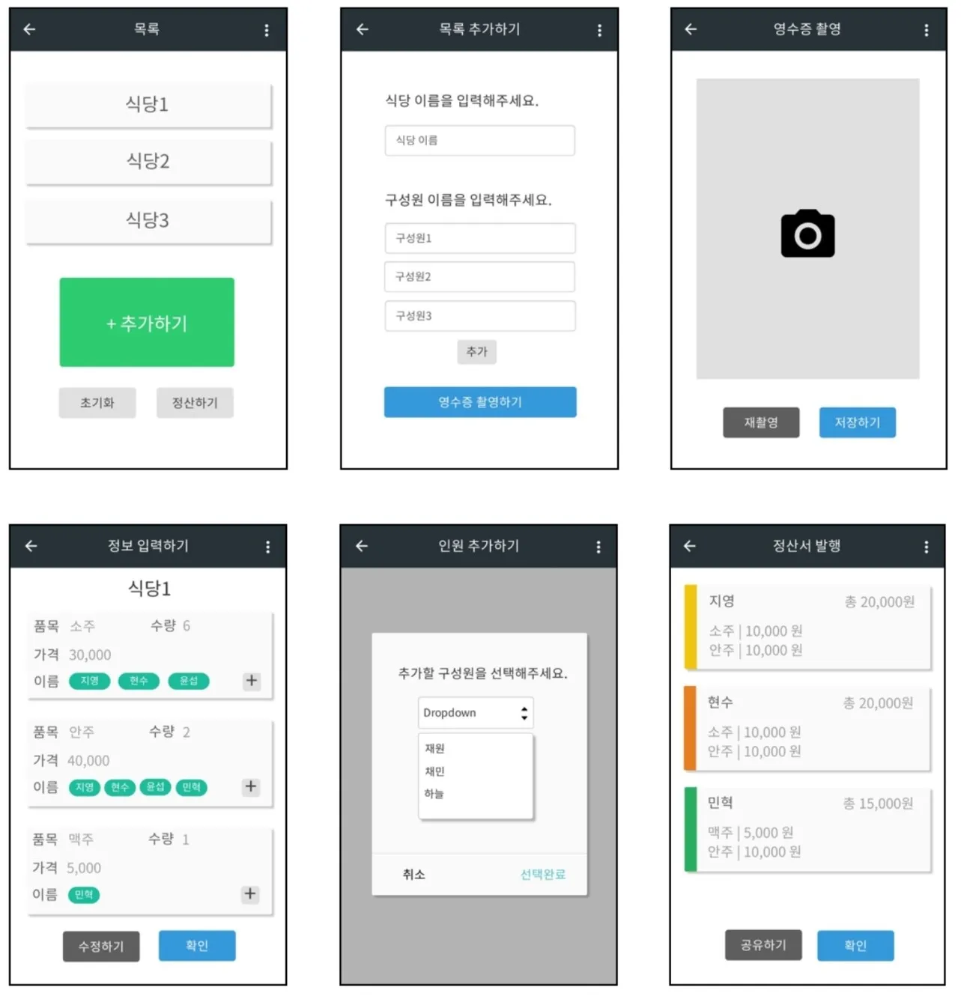
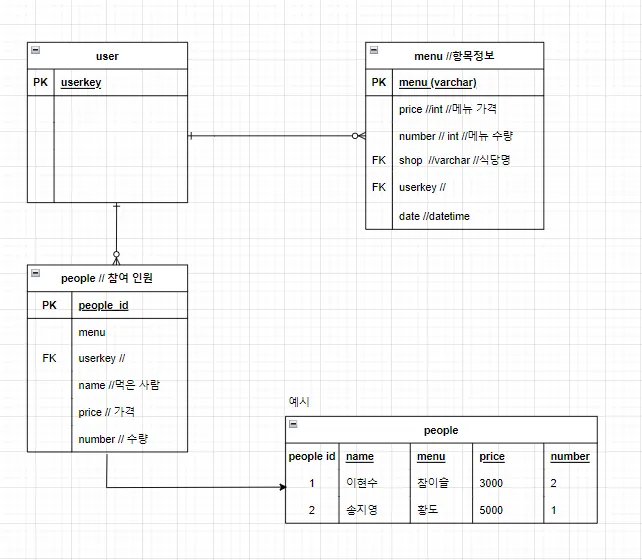
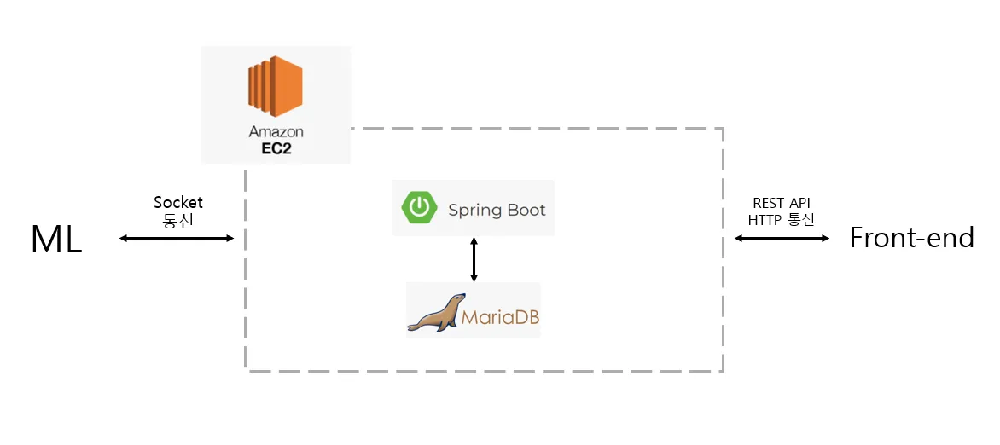

## Game Programmer 😊
저는 RPG, FPS 그리고 PC, 모바일 등 장르와 플랫폼을 불문하고 여러 게임을 플레이하는 게이머로서 멀티 서버를 구현하는 것을 좋아하는 개발자입니다. 저는 무엇이든 기본기를 중요하게 생각합니다. 두꺼운 책으로 공부하는 학습 방법을 선호합니다. 새로운 분야에 즐겁게 도전하는 편입니다. 함께 일하는 여러 사람들과 늘 우호적인 관계를 유지해왔습니다.

## Stacks
C 🟩🟩⬜⬜⬜
- 기본적인 C 구문을 이해, malloc과 포인터의 이해

C++ 🟩🟩⬜⬜⬜
- 기본적인 C++ 구문을 이해, STL과 메모리 관리에 대한 이해
- auto, constexpr 등 Modern c++에 대한 학습 진행 중

Java 🟩🟩🟩⬜⬜
- 객체지향 프로그래밍의 개념 이해, JVM 이해, MVC 패턴 등 디자인 패턴 숙지
- 스프링 부트를 이용한 웹프로젝트 배포 경험 있음

Python 🟩🟩🟩⬜⬜
- 머신 러닝 관련 라이브러리 활용 Numpy, Matplotlib, OpenCV 등
- 크롤링과 파일 입출력에 대한 코드 작성 능력

## Projects
- 더치페이잇 (더치페이 도우미 앱) : 23.01

## Activity History
- 구글 GDSC 개발 동아리 (백엔드 서버 파트) : 22.06 - 23.02
    - Java, Spring Boot 학습, 알고리즘 스터디, 팀프로젝트 수행 등

## 더치페이잇 (더치페이 도우미 앱) : 23.01 (BE팀 기여도 40%)

### 팀구조
APP / ML / **BE**

### 스킬
**BE : Aws ec2, Spring Boot, Java, Maria DB**  
APP 및 ML : Flutter, Python

### 프로젝트 설명
- 카메라로 영수증 사진을 찍어서 메뉴/수량별 더치페이 기능
- 영수증의 메뉴/항목을 구별하기 위해 ML 오픈소스 활용
- 더치페이를 하기 전에 정산내역서를 사용자에게 보여주는 기능
- 홈화면, 식당명 및 구성원 입력창 & 사진 인식 확인, 정산내역서 화면

### ERD 설계

### 서버 구조

### 트러블 슈팅
- 이미지에 대해 처리 과정 문제를 영수증 이미지를 APP과 BE간 통신을 HTTP 통신으로, ML 파트와 BE파트간 TCP 소켓통신으로 구현하여 해결하였습니다.

### 역할 (기여도 40%)
- API 명세서, 쿼리문 작성
- 테이블 생성, CRUD 기능 구현
- Image POST API 구현, ML 파이썬과 Java간 소켓 통신 구현