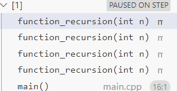

```cpp
#include <iostream>

using namespace std;

int function_recursion(int n){
    if (n>0)
    {
        /* code */
        function_recursion(n-1);
        cout << n << " " << endl;
    }
}

int main(){
    int x = 3;
    function_recursion(x);
    return 0;
}
```
## 재귀 함수(Recursion)
- 함수가 자기 자신을 호출하는 기법
- for 문과 비슷해보인다. 다만 for문은 코드의 진행이 오름차순으로만 일어난다면, 재귀함수는 오름차순과 함께 함수 호출 종료와 동시에 복귀에 따른 내림차순의 동작이 추가되어 있다고 생각할 수 있다.

__for을 사용했을때__
```cpp
int function_for(int n){
    for (; n>0; n--)
    {
        /* code */
        cout << n << " " << endl;
    }
}

int main(){
    int x = 3;
    function_for(x);
    return 0;
}
```
출력 코드문이 실행되고 다음 코드로 넘어갈뿐 돌아오지 않는다 (오름차순)

__재귀의 경우__
```cpp
int function_recursion(int n){
    if (n>0)
    {
        /* code */
        function_recursion(n-1);
        cout << n << " " << endl;
    }
}
```
위 코드에서는 재귀를 선 호출하고 복귀했을때 출력을 하도록 구성하였다.
그래서 반복문 코드와 다른 출력 결과를 얻을 수 있다. (n=3일때, o/p:1 2 3)
호출 종료, 원래 위치로 복귀하는 과정이 내림차순이라 볼 수 있다.

### 재귀 함수에 포함되어야할 것
기저 조건(Base Case): 재귀 호출을 멈추기 위한 조건. 이 조건이 만족되면 더 이상 자기 자신을 호출하지 않고 결과를 반환하여, 무한 루프를 막는다.

재귀 호출(Recursive Case): 함수가 자기 자신을 호출하는 부분. 더 작은 문제로 분할하여 해결함.

### 재귀 과정

제일 상단의 재귀함수 코드를 보자. 해당 재귀의 끝에 갔을 때의 스택 상황을 볼 수 있다. 기저 조건을 만나기 전까지 스택 메모리에 함수 호출 당시의 주소와 상황을 저장하며 넘어간다. 네번째 function을 호출했을때 `if n > 0` 의 조건을 맞추지 못하여 기저 조건이 만족되고 호출 종료되면서 이전 함수로 돌아가게 된다.

그리고 n은 이때 1이므로 1이 출력된다. 이후 이와 같은 과정을 거치며 호출됐던 모든 함수의 종료와 복귀 과정을 거쳐 마무리되며 1 2 3같이 출력이 나타나게 된다.