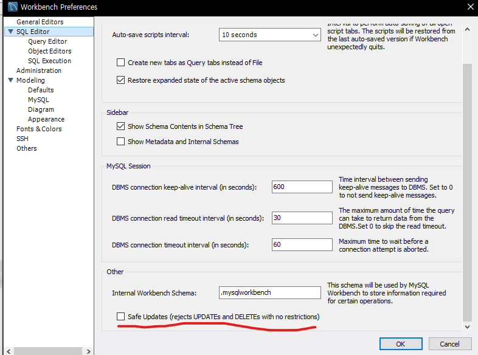

## 코드 1175
데이터를 실수로 넣어 delete로 모든 행을 삭제하려고 할때 뜨는 에러가 있다.

```
Error Code: 1175. You are using safe update mode and you tried to update a table without a WHERE that uses a KEY column.  To disable safe mode, toggle the option in Preferences -> SQL Editor and reconnect.
```

보안의 이유로 데이터를 직접 수정/삭제할때는 where로 key값을 특정해줘야만 수행이 가능하다.


개발 단계에서는 영구적으로 설정을 통해 경고를 disable 해주는 방법도 괜찮을 것이다.

혹은 일시적으로 해제하는 방법이 있다.
SQL문 전 행에
```
set sql_safe_updates=0;
```
을 적용해주면 일시적으로 disable이 가능하다.

## 코드 1451

```
Error Code: 1451. Cannot delete or update a parent row: a foreign key constraint fails (`test`.`user_authority`, CONSTRAINT `FKpqlsjpkybgos9w2svc` FOREIGN KEY (`user_id`) REFERENCES `user` (`user_id`))
```

위 에러코드를 해결한 후 다시 delete를 하려고 봤더니 외래키가 묶여있어 삭제를 못한다는 말.. SQL문을 쓰다보면 자주 깜빡하는 항목인데   

삭제하려는 테이블이 외래키로 다른 테이블에 존재한다면 삭제했을 경우 데이터의 무결성에 문제가 생길 수 있을것이다.

따라서 얽혀있는 데이터를 먼저 제거해주면 무결성을 지킬 수 있을것이다.

```
delete from user_authority;
delete from user;
delete from authority;
```

외래키를 가지고 있는 테이블 행을 먼저 제거하여 더 이상 에러코드가 뜨지 않게 해줄 수 있다.