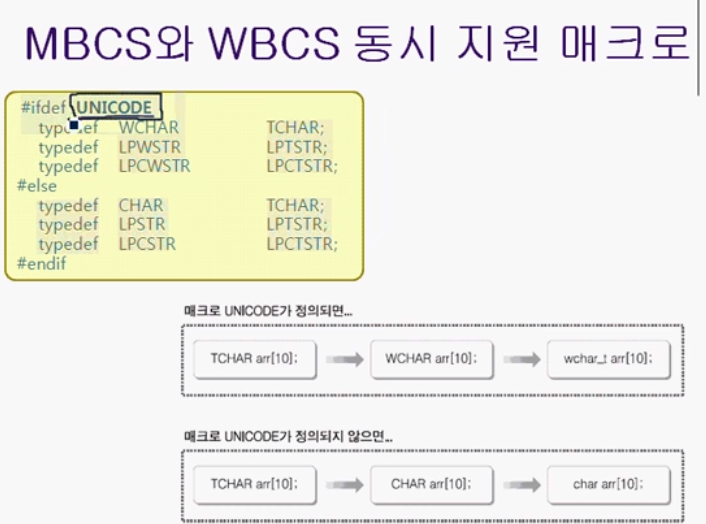

# 2장 아스키코드 vs 유니코드
## Windows 에서의 유니코드(UNICODE)
### 문자셋의 종류와 특성
- 아스키코드 (ASCII CODE) : 미국에서 정의하는 표준. 1바이트로 표현. 한글와 같은 다른언어를 표현하는데 쓰기 어려움.
- 유니코드 (UNICODE) : 2바이트로 표현되기 때문에 한글을 충분히 표현 가능


유니코드를 전부 쓰면 편하다. 하지만 옛날 시스템, OS는 여전히 MBSC, WBSC 방식을 사용하는 곳이 존재한다.

### MBCS 기반의 문자열
```cpp
#include "stdio.h"
#include "string.h"

int main()
{
    char str[] = "ABC한글";
    int size = sizeof(str);
    int len =-strlen(str);

    printf("array size  : %d \n" , size );
    printf("str size  : %d \n", len);

    return 0;
}
```
```
array size  : 8
str size  : 7
```
한글은 2바이트로 처리되고 있다. 이 결과는 mbsc를 기반으로 실행됨을 보여준다.

하지만 ABC (길이 3) 한글 (길이 4) = 7 의 결과를 보면 한글이라는 단어가 4로 인식되고 있다. 이게 mbsc의 문제점이다.

이는 WBSC 방식을 사용하여 모든 문자를 2바이트로 처리함으로써 문제점을 해결할 수 있게 된다.

### WBCS 기반의 프로그래밍
wbsc방식으로 프로그래밍하기 위해선 신경써야할 일이 있다.

`char을 대신하는 wchar_t`
char은 1바이트 메모리만 할당, wchar_t는 2바이트 메모리공간에  할당된다.

`"ABC" 를 대신하는 L"ABC"`
```
wchar_t str [] = L"ABC";
```

### WBSC기반 문자열 조작 함수 (참고)


## MBCS 와 WBCS 의 동시 지원
### MBCS 와 WBCS (유니코드)를 동시에 지원하기 위한 매크로


### MBCS 와 WBCS (유니코드)를 동시에 지원하기 위한 함수들
