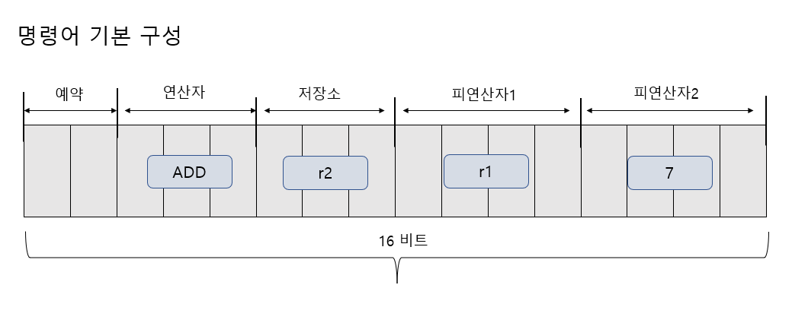
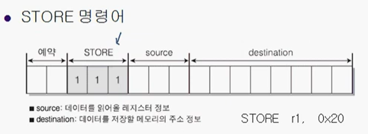

## 컴퓨터 구조의 접근 방법
### 컴퓨터를 디자인하자
프로그래머 관점
- 컴퓨터를 잘 아는 프로그래머도 컴퓨터 디자인에 참가
- 컴퓨터 디자인은 레지스터와 명령어 디자인 (프로그램 전문가들이 보통 디자인)

GPU도 CPU의 일종이다. 만약 GPU를 디자인 한다면 H/W, ASIC, 알고리즘, 인터페이스, 프로그램 전문가 등도 설계에 참여한다. 하드웨어 전문가만 CPU를 디자인 하는것이 아닐 수 있다는 점.

### 레지스터를 디자인하자
레지스터는 몇 비트?
몇 개의 레지스터?
명령어는 몇 비트?
무슨 용도로?

레지스터는 8,16,32,64비트 등으로 만들 수 있을 것이다. n비트 시스템에서의 명령어의 길이는? n비트이다. 명령어가 n비트라면 레지스터 또한 n비트여야지 하나의 명령어를 하나의 레지스터에 온전히 저장할 수 있을것이다.

여기서는 학습의 목적이기 때문에 16비트로 디자인할 것 이다. (32,64비트는 학습 목적으로 부담됨)

레지스터는 다다익선이지만,
무작정 늘릴 수 없기에 8개로 구성했다. 

r0 ~ r3 까지 범용 레지스터
r4 ~ r7 까지 특정 용도로 레지스터를 디자인하였다.

용도를 왜 정할까?
- 명령어가 단순해지고, 속도가 빨라진다. (용도가 정해져있어 고민이 필요x)

만약 범용적으로 사용한다면 다음과 같은 단점을 가질 수 있다.
- 범용 레지스터는 특정 작업에 최적화 x, 모든 작업에 대해 평균 성능을 제공
- 리소스 낭비, 모든 용도로 지원하기 때문에 특정 비트나 리소스가 낭비
- 모든 작업이 동일한 레지스터를 사용하면 병목 현상 발생 가능성o

### 명령어 구조 및 명령어를 디자인하자
명령어가 디자인되어야 ALU가 디자인된다. 명령어 디자인이 cpu디자인과 동시에 진행돼야한다. cpu디자인은 하드웨어 뿐만 아니라 소프트웨어 전문가의 영역이 될 수 도 있다는 점

CPU 디자인이 다르다면 명령어 구조도 달라진다.. 그렇다는 말은 어셈블리 언어로 구현된 프로그램은 구조가 다른 cpu에 이식이 불가능해진다는 것도 알게 되었을것이다.


사칙연산 명령어 구성.
*명령어에 따라 구조가 달라질 수 있다.
- 연산자의 비트는 3개로 구성 (총 8개의 연산자를 할당가능하다는 말)
- 피연산자 1,2는 레지스터와 숫자가 올 수 있다

|연산의 의미 | 심볼 | 2진 코드
:---| :---| :---|
|덧셈 | ADD | 001
|뺄셈 | SUB | 010
|곱셈 | MUL | 011
|나눗셈 | DIV | 100 |
연산자를 정의하자. 어셈블리어의 심볼도 함께 정의해주었다.
*2진 코드는 구별만 되면 값은 상관없다.

|레지스터 심볼 | 2진 코드 |
:------|:-------|
|r0 | 000|
|r1 | 010|
|r2 | 010|
|r3 | 011|
|r4 , ir| 100|
|r5 , sp| 101|
|r6 , lr | 110|
|r7 ,pc | 111|

8개의 레지스터로 구성했으니 2진 코드도 3개의 비트로 구성해주면 표현이 가능하다.

피연산자 1,2는 레지스터와 숫자가 올 수 있는데, 여기서 문제가 발생한다. 명령어의 비트만 보고 이게 숫자와 레지스터 중에 뭘 의미하는지 모르기 때문에,

하나의 비트를 구별자로 두어야만 한다. 예를 들어 4개의 비트 중에서 첫번째 비트가 0일땐 뒤 세비트가 레지스터를 뜻하고, 1일땐 숫자를 뜻하도록 구성한다면,

뒤 3개의 나머지 비트를 레지스터나 숫자를 저장하도록 사용할 수 있을것이다. 그렇다면 0~7까지만 나타나진다는 문제점이 발생할 수 있다는 점을 상기하고 넘어가자.

명령어 해석 예시) ADD r2 r1 7 
-> r1레지스터의 값과 숫자 7을 ADD해서 r2 레지스터에 저장해라.

### RISC vs CISC
Reduced .. vs Complex ..
CPU 설계 철학을 구분하는 두 가지 주요 접근 방식

CISC는 강력하고 다양한 명령어,기능들 덕분에 가벼운 소프트웨어를 만든다.
그럼에도 RISC를 현대 CPU가 사용하는 이유가 무엇일까?

간단하게 말하자면 속도와 성능을 키우기위해서 CISC는 지극히 제한적인 반면, RISC는 고성능 CPU에 적합하다.

모든 CPU의 명령어 실행 과정은 Fetch Decode Execute의 단계를 거친다.
하나의 과정당 1clock이 소모된다면 하나의 명령어당 3clock이 소모될 것이다.

이때 RISC은 병렬로 실행하여 N+2의 시간만으로 처리가 가능하다. (현대의 CPU들의 성능이 클럭 순으로 나열되지 않는 이유)
*컴퓨터 구조의 파이프라이닝(Pipelining)

## LOAD & STORE 명령어 디자인
### LOAD & STORE 명령의 필요성
"사칙 연산 결과를 레지스터에만 저장할 수 있도록 하겠다" 라는 제약 사항 덕분에 다음과 같은 연산을 할 수 없다.
* 피연산자로 오는건 숫자와 레지스터 뿐이기에
```cpp
int a = 10; // 0x10 번지 할당
int b = 20; // 0x20 번지 할당
int c = 0; // 0x30 번지 할당
c = a + b;
```
여기서 네번째 줄을 실행하기 위해서는 다음과 같은 문장을 구성해야한다.
"0x10번지(a)에 저장된 값과 , 0x20 번지 (b)에 저장된 값을 더해서 0x30 번지(c)에 저장해라"

하지만 RISC에서는 메모리 주소를 피연산자로 받을 수 없기에 불가능하다!

이때 LOAD와 STORE가 필요하게 된다.


### LOAD & STORE 명령어의 디자인
사칙 연산 명령어의 비해 피연산자가 2개가 된다. 
 
load를 110 이진코드로 구성하고 가져올 메모리 주소와 목적지인 레지스터 값을 알면 되기에  destination source으로 디자인해준다.

LOAD r1, 0x20
"0x20번지에 존재하는 데이터를 레지스터 r1에 저장하라"

* LOAD를 받으면 피연산자를 두개로 구성한다는 것을 알고 적절한 처리를 할 것이다. 이는 명령어의 형태에 따라 컨트롤 유닛이 디자인된다는 것을 의미한다.

 
같은 원리로 구성한다. 

이제 앞의 예제를 해당 명령어를 섞어 다시 실행해보자.

이렇게 구성하자.

덧셈 연산의 피연산자는 숫자이거나 레지스터가 되어야한다고 정의했기 때문에 문제가 되는 것인데,

피연산자가 레지스터가 되게끔 메모리에 저장된 값을 레지스터에 로드하여 진행하면 되지 않겠는가? 이후 적절한 결과값을 다시 레지스터에서 메모리 주소로 옮기는 STORE를 해주면 실행이 끝날 것이다.

## Direct 모드와 Indirect 모드
### Direct 모드의 문제점과 Indirect 모드의 제안
현재까지 언급된 메모리 접근 방법을 Direct 모드라 하는데, 다시 LOAD 명령어를 보면 source의 용량이 8비트 뿐이다 즉 0x00ff까지의 데이터만 저장할 수 있는셈.

만약 0x0100의 데이터를 담아야한다면 지금 방법으로는 불가능할 것이다.

### Indiret 모드의 이해


*수정) LOAD r1, [0x10] 실행시 (Indirect)
명령어에서 주소에 []를 씌우면 Indirect 방식을 동작하게 구성하였다.

두 차이를 알겠는가?
레지스터에 저장할 데이터가 존재하는 주소를 직접적으로 표현한 것은 direct,
0x10번지에서 값을 읽어오는것이 아닌 해당 번지에 저장된 주소값을 참조하여 값을 읽어오는 것은 indirect 방식이다.

물론, 어셈블리어로 []를 인식하지만 명령어는 두방식을 인식하지 못할 것이다 이때, 사용하지 않은 명령어의 첫 두비트를 이용해주면 되겠다.
indirect는 11 direct 방식은 01 이런식으로

Indirect 모드 활용 예제

### 출처
윤성우,  ⌜뇌를 자극하는 윈도우즈 시스템 프로그래밍⌟, 한빛미디어, 2006  
유튜브, "한빛미디어", "뇌를 자극하는 윈도우즈 시스템 프로그래밍", https://www.youtube.com/watch?v=GVX-m3RF-K0&list=PLVsNizTWUw7E2KrfnsyEjTqo-6uKiQoxc
Github, "system_programming", https://github.com/connieya/system_programming