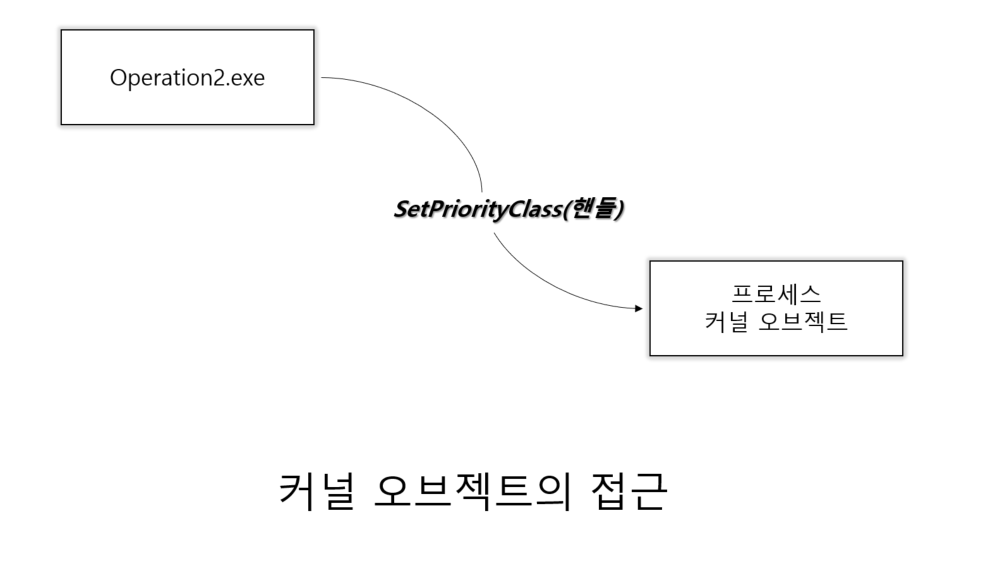
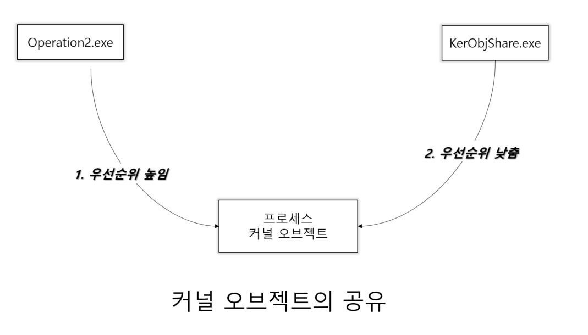

## 커널 오브젝트와 핸들의 종속 관계
### 커널 오브젝트의 종속 관계
"커널 오브젝트는 Windows 운영체제에 종속적이다."

- __커널 오브젝트는 프로세스에 종속적인 것이 아니라, 운영체제에 종속적인 관계로 커널 오브젝트의 소멸 시점은 운영체제에 의해서 결정된다.__

- 커널 오브젝트는 프로세스에 종속적인 것이 아니라 운영체제에 종속적인 관계로 여러 프로세스에 의해서 접근 가능하다. (물론, 함수 호출을 이용한 간접 호출임)

### 핸들의 종속 관계
그와 별개로
"핸들은 운영체제에 종속적이지 않고 프로세스에 종속적이다."

### 예제를 통한 종속 관계의 이해
커널 오브젝트가 여러 프로세스에 의해 접근 가능한 예시를 봐보자. 이 예제의 시나리오는 다음과 같다.

"A 프로세스가 B 프로세스를 생성한다. 그러자 B 프로세스는 자신의 우선순위를 높인다. 잠시 후 열받은 A 프로세스는 B 프로세스의 우선순위를 원래대로 돌려 놓는다."

커널 오브젝트와 Usage Count
명령 프롬프트 프로젝트 기능 추가

### 출처
윤성우,  ⌜뇌를 자극하는 윈도우즈 시스템 프로그래밍⌟, 한빛미디어, 2006  
유튜브, "한빛미디어", "뇌를 자극하는 윈도우즈 시스템 프로그래밍", https://www.youtube.com/watch?v=GVX-m3RF-K0&list=PLVsNizTWUw7E2KrfnsyEjTqo-6uKiQoxc
Github, "system_programming", https://github.com/connieya/system_programming