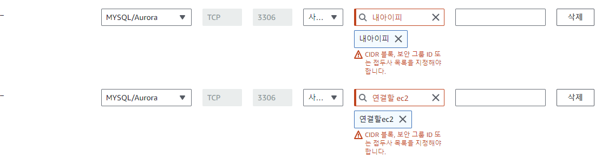
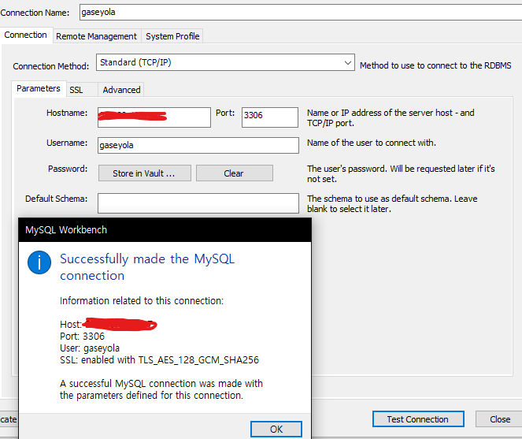

앞에 내용에 이어서, 생성한 ec2의 mysql에 인바운드가 가능하게 환경 세팅을 해보자

### 보안그룹 설정
먼저 aws 아이피 내로 접속하기 위해 보안그룹을 건들인다. 연결이 되었는지 확인하기 위한 내 로컬아이피와 서버와 연결할 ec2 아이피를 규칙으로 허용,설정해준다.


그렇다면, 이제 규칙에 따라 저 아이피와 포트로 들어오는 연결은 허용되었을것이다.

하지만 mysql의 자체 bind-address에 설정되지 않으면, 결국 ec2상의 mysql에 접근하지 못할것이다.

### 외부 접속 허용
아래 명령어들을 통해 설정파일로 접근,
```cmd
sudo su

cd etc/mysql/mysql.conf.d
vi mysqld.cnf
//이후 설정해주기
bind-address            = 0.0.0.0
mysqlx-bind-address     = 0.0.0.0 //함께 설정
```
옛날에는 mysqlx-bind-address 해당 코드가 따로 없거나 설정하지 않았던 걸로 기억하는데, 처음에 설정하지 않았더니 외부 접속이 가능하지 않아 함께 설정하여 해결하였다.

### 접속 테스트
쉽고 간단한 방법으로 mysql workbench를 사용하였다.
미리 설정해준 유저와 비밀번호, ec2 ipv4를 입력해 test connection을 해보았다. 정상인 모습.


