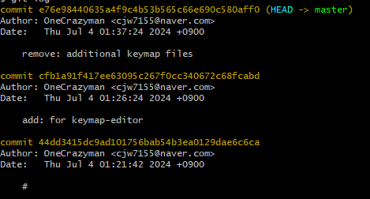

---


깃을 정리하다 필수파일`west.yml`을 함께 삭제해버려 워크플로우에 이상이 생겼다.

### 복구 원리
파일을 삭제하기 전 커밋이자, `west.yml`이 존재하던 시점의 커밋으로 돌아가 복구시켜보자

### 복구 과정
```git
git log
```

첫번째 커밋에서 파일을 삭제했기 때문에, 아래 과거의 커밋 중 하나를 골라 해당 파일을 체크아웃한다.

이전 해시가 44dd3415dc9ad101756bab54b3ea0129dae6c6ca
일때,
```git
git checkout 44dd3415dc9ad101756bab54b3ea0129dae6c6ca
 -- west.yml
```

```
git add west.yml
git commit -m "fix: west.yml 복구"
git push
```

