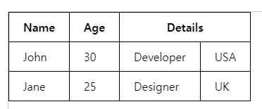

### 용어
tr : table row 표의 한 행, 테이블에서 가로 방향으로 데이터를 그룹화합니다.  
td : table data의 줄임말, 표시할 데이터가 들어갑니다. 표의 열에 따라 위치합니다.  
th : 테이블의 헤더 셀을 나타내는 태그. 주로 테이블의 제목이나 범주를 표시함

### 예제
```
<table>
    <tr>
        <td>이름</td>
        <td>나이</td>
        <td>직업</td>
    </tr>
    <tr>
        <td>John</td>
        <td>30</td>
        <td>개발자</td>
    </tr>
    <tr>
        <td>Jane</td>
        <td>25</td>
        <td>디자이너</td>
    </tr>
</table>
```


```
<table>
    <tr>
        <td colspan="2">이름과 나이</td>
        <td>직업</td>
    </tr>
    <tr>
        <td>John</td>
        <td>30</td>
        <td rowspan="2">개발자</td>
    </tr>
    <tr>
        <td>Jane</td>
        <td>25</td>
    </tr>
</table>
```


```
    <table border="1">
        <thead>
            <tr>
                <th>Name</th>
                <th>Age</th>
                <th colspan="2">Details</th>
            </tr>
        </thead>
        <tbody>
            <tr>
                <td>John</td>
                <td>30</td>
                <td>Developer</td>
                <td>USA</td>
            </tr>
            <tr>
                <td>Jane</td>
                <td>25</td>
                <td>Designer</td>
                <td>UK</td>
            </tr>
        </tbody>
    </table>
```
