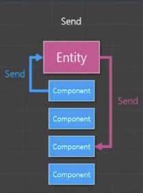
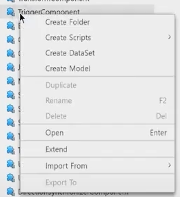

### self 엔티티로 Send하기

```lua
for i = 1, 10 do
...
local LogEvent = LogEvent()
LogEvent.message = tostring(i)
self.Entity:SendEvent(LogEvent)
...
```

### 다른 엔티티로 Send하기

```lua
--어느 컴포넌트의 함수에서
local rabbitEntity = _EntityService:GetEntity("[RUID이름]") --rabbit 엔티티를 가져와서
rabbitEntity:SendEvent(LogEvent) --send함
```

### 컴포넌트 확장

  
- Extend 기능을 통해 컴포넌트를 확장시킬 수 있다.
- 확장된 컴포넌트는 원본 컴포넌트의 모든 기능을 포함하고 수행할 수 있다.
- Overridable Function의 경우 오버라이딩이 가능하며, 이때 `__base:On[원래함수]`를 통해 기존 내용을 유지할지 지우고 아예 새로운 로직을 구성할지 정할 수 있다.