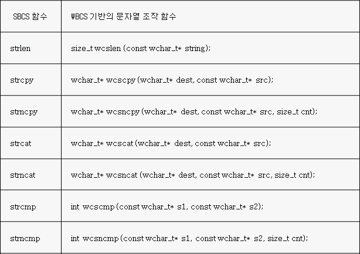
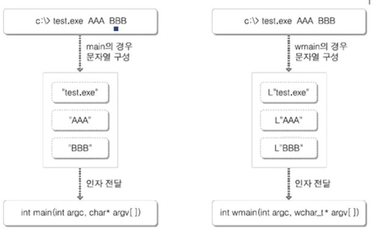
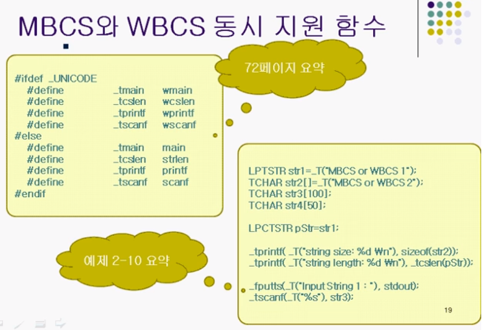

## Windows 에서의 유니코드(UNICODE)
### 문자셋의 종류와 특성
- 아스키코드 (ASCII CODE) : 미국에서 정의하는 표준. 1바이트로 표현. 한글와 같은 다른언어를 표현하는데 쓰기 어려움.
- 유니코드 (UNICODE) : 2바이트로 표현되기 때문에 한글을 충분히 표현 가능


유니코드를 전부 쓰면 편하다. 하지만 옛날 시스템, OS는 여전히 MBSC, WBSC 방식을 사용하는 곳이 존재한다.

### MBCS 기반의 문자열
```cpp
#include "stdio.h"
#include "string.h"

int main()
{
    char str[] = "ABC한글";
    int size = sizeof(str);
    int len =-strlen(str);

    printf("array size  : %d \n" , size );
    printf("str size  : %d \n", len);

    return 0;
}
```
```
array size  : 8
str size  : 7
```
한글은 2바이트로 처리되고 있다. 이 결과는 mbsc를 기반으로 실행됨을 보여준다.

하지만 ABC (길이 3) 한글 (길이 4) = 7 의 결과를 보면 한글이라는 단어가 4로 인식되고 있다. 이게 mbsc의 문제점이다.

이는 WBSC 방식을 사용하여 모든 문자를 2바이트로 처리함으로써 문제점을 해결할 수 있게 된다.

### WBCS 기반의 프로그래밍
wbsc방식으로 프로그래밍하기 위해선 신경써야할 일이 있다.

`char을 대신하는 wchar_t`
char은 1바이트 메모리만 할당, wchar_t는 2바이트 메모리공간에  할당된다.

`"ABC" 를 대신하는 L"ABC"`
```
wchar_t str [] = L"ABC";
```
`strlen을 대신하는 wcslen`
```cpp
#include <stdio.h>
#include <string.h>

int main() {
	wchar_t str[] = L"ABC";
	int size = sizeof(str);
	int len = strlen(str);

	printf("배열의 크기: %d \n", size);
	printf("문자열 길이: %d \n", len);

	return 0;
}
```
strlen()에서 컴파일 에러가 발생한다. 그 이유는 무엇일까?
str은 유니코드 기반이기 때문에 SBSC 기반의 함수인 strlen은 처리하지 못하기 때문이다.

__수정된 예제__
```cpp
#include <stdio.h>
#include <string.h>

int main() {
	wchar_t str[] = L"ABC";
	int size = sizeof(str);
	int len = wcslen(str);

	printf("배열의 크기: %d \n", size);
	printf("문자열 길이: %d \n", len);

	return 0;
}
```
```
배열의 크기: 8
문자열 길이: 3
```
유니코드 방식의 char이니 각 2바이트씩 null문자까지하면 총 8바이트이다.

### WBSC기반 문자열 조작 함수 (참고)


### wmain 함수에 대한 이해
```cpp
#include <stdio.h>

int main(int argc, char* argv[]) {
	int i;
	for (i = 0; i < argc; i++)
	{
		fputws(argv[i], stdout);
	}
	return 0;
}
```
이 코드를 실행하면 컴파일에러가 발생한다.

WBSC기반 fputws을 사용한건 좋았지만 출력이 되는 문자열이 유니코드 기반이 아니란 점이다.

main 함수는 전달되는 문자열을 MBSC 기반으로 구성하기 때문에 제대로 실행될 수 없다.

이제 매개변수 문자열을 유니코드 기반으로 구성하기 위한 wmain을 살펴보자. 

wmain 함수로 시작되는 프로그램은 실행 시 전달되는 문자열을 유니코드 기반으로 구성한다는 것이다.

아래는 완전한 유니코드 기반으로 코드를 재구성한 것이다.
```cpp
#include <stdio.h>

int wmain(int argc, wchar_t* argv[]) {
	int i;
	for (i = 0; i < argc; i++)
	{
		fputws(argv[i], stdout);
		fputws(L"\n", stdout);
	}
	return 0;
}
```
```
>cpp.exe AAA BBB CCC

cpp.exe
AAA
BBB
CCC
```
## MBCS 와 WBCS 의 동시 지원
### MBCS 와 WBCS (유니코드)를 동시에 지원하기 위한 매크로


### MBCS 와 WBCS (유니코드)를 동시에 지원하기 위한 함수들


## 그리고 UTF-8
가장 널리 사용되는 유니코드 인코딩 방식
- MBSC와 SBSC 방식의 특징을 둘다 가지고 있다

가변 길이 인코딩 방식이며, 문자를 1바이트에서 4바이트로 인코딩 한다.
- ASCII와 완벽히 호환된다.
1바이트로 표현될때 ASCII와 코드 포인트가 동일 하기에 기존의 아스키 기반 시스템에서 문제가 발생하지 않는다.

### 출처
윤성우,  ⌜뇌를 자극하는 윈도우즈 시스템 프로그래밍⌟, 한빛미디어, 2006  
유튜브, "한빛미디어", "뇌를 자극하는 윈도우즈 시스템 프로그래밍", https://www.youtube.com/watch?v=GVX-m3RF-K0&list=PLVsNizTWUw7E2KrfnsyEjTqo-6uKiQoxc
Github, "system_programming", https://github.com/connieya/system_programming