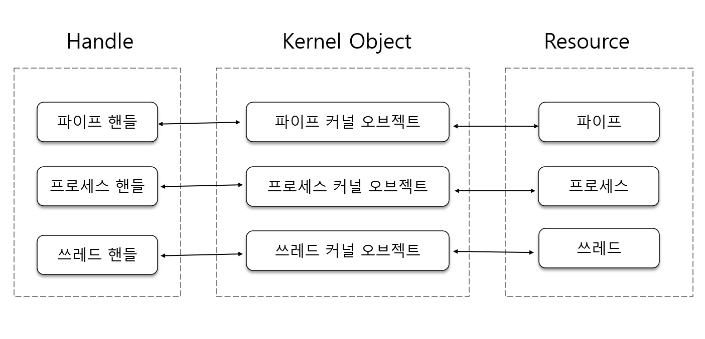

## 커널 오브젝트에 대한 이해
커널이란, 컴퓨터를 운영하는 데 있어서 중심이 되는 운영체제 핵심 부분을 뜻하는 것이다. 일반적으로 운영체제라는 용어와 같은 의미로 사용된다.

다만, 커널 오브젝트라는 단어는 고유명사로 이해하는 것이 좋다. 

"커널에서 관리하는 중요한 정보를 담아둔 데이터 블록을 가리켜 커널 오브젝트라 한다."

### 커널 오브젝트의 이해
5장에서 CreateProcess 함수 호출을 통해서 프로세스 생성을 요구하였고, Windows 운영체제가 우리의 요구에 맞게 프로세스를 생성해 주었다. 따라서 프로세스를 생성하는 실질적인 주체는 프로그래머가아니라 운영체제라고 해야 정확한 표현이 된다.

여러 개의 프로세스를 관리할 때, 운영체제 입장에서 고정적으로 저장하고 갱신해야할 정보들이 생기기 마련이다.

예를 들어 프로세스 상태 정보(Running, Blocked, Ready 상태)와 우선순위 정보는 운영체제 내부에서 저장되어야 한다. 그리고 프로세서 상태 정보와 프로세스 우선순위 정보가 변경될 때마다 갱신되어야 한다. 그래야 프로세스 스케줄러가 이 정보를 바탕으로 프로세스를 관리할 수 있다.

이렇듯 운영체제가 프로세스를 관리하기 위해서는 프로세스에 관련된 몇몇 정보를 저장할 수 있어야 하고, 참조 및 변경도 가능해야 한다. 이를 위해서 Windows 운영체제 개발자들은 구조체 하나를 정의하기에 이른다. 이 구조체는 프로세스 상태 정보를 저장하기 위해 정의한 것이다. 이 구조체를 내용 전개 편의상 '프로세스 관리 구조체'라 부르겠다. 프로세스를 관리하기 위해 필요한 구조체라는 뜻이다.

물론 프로세스가 생성될 때마다 '프로세스 관리 구조체' 변수가 하나씩 생성되고, 새롭게 생성된 프로세스 정보들로 초기화되는데, 이것이 바로 커널 오브젝트의 정체이다


구조체의 이름은 _PObject로 표시하고 있는데, 이는 어디까지나 가정일 뿐이다. 프로세스의 커널 오브젝트는 프로그래머가 직접 생성하거나, 조작할 수 없기에 이정도 이해면 충분하다.

### 그 이외의 커널 오브젝트들
프로세스가 생성될 때에만 커널 오브젝트가 생성되는 것은 아니다. 프로세스 내에서 프로그램 흐름을 구성하는 쓰레드를 새성할 때에도, IPC(Inter Process Communication) 를 위해 사용되는 파이프나 메일슬롯을 생성할 때에도 커널 오브젝트를 생성해서 필요한 정보들을 채워야만 한다. 그래야 운영체제가 이들을 관리할 수 있다. 뿐만 아니라 Windows 에서는 파일을 생성할 때에도 커널 오브젝트가 생성된다. 파일 조차도 Windows 커널에 의한 관리 대상이기 때문이다.

그렇다면 윈도우에서 만드는 모든 종류의 커널 오브젝트들은 동일한 구조체일까? 아니다. 커널 오브젝트 종류에 따라서 서로 다른 구조체를 기반으로 생성된다.

"Windows 운영체제는 프로세스, 쓰레드 혹은 파일과 같은 리소스들을  원활히 관리하기 위해 필요한 정보를 저장해야 한다.  이때 데이터를 저장하는 메모리 블록을 가리켜 커널 오브젝트라 한다."


### 오브젝트 핸들(Handle)을 이용한 커널 오브젝트의 조작
프로그래머가 직접 커널 오브젝트를 조작할 수 없지만 함수 호출에 의한 간접적인 조작은 가능하다.

Windows 에서 관리하는 리소스 특성을 변경시키기 위해서는 (프로세스 우선순위 변경과 같은) 해당 리소스의 커널 오브젝트르 조작해야만 하는데, 직접적인 조작은 불가능하지만 마이크로소프트에서 제공해 주는 시스템 함수를 이용하면 간접적 조작은 가능하다.

`프로세스의 우선순위 변경`
``` cpp
BOOL SetPriorityClass {
	HANDLE hProcess, // 우선순위를 변경할 프로세스의 __핸들(handle)__을 전달한다.
	DWORD dwPriorityClass // 새롭게 적용할 우선순위 정보를 전달한다.
}
```
* 핸들이란, 커널 오브젝트에 할당되는 숫자에 지나지 않는다.

`커널 오브젝트에 할당되는 숫자! 핸들(Handle)`
특정 프로세스의 우선 순위를 높이고 싶다.
그렇다면 우선순위 정보를 변경해줘야한다. 앞에서 살펴본 함수를 통해 다음과 같은 요구를 한다.

"저기 있는 저 커널 오브젝트에 저장된 우선순위 정보를 높여 주세요"

여기서 문제는 특정 커널 오브젝트를 가리키는 것. 윈도우에서는 커널 오브젝트 생성시 정수값을 하나씩 부여하기때문에 쉽게 해결이 가능하다.



지금까지 설명한 핸들은 "커널 오브젝트 핸들" 또는 "오브젝트 핸들" 이라고도 불리고 있다.

`핸들 정보는 어디서?`
`Operation1.cpp`
```cpp
#include <stdio.h>
#include <tchar.h>
#include <windows.h>

int _tmain(int argc, TCHAR* argv[])
{
	STARTUPINFO si = { 0, };
	PROCESS_INFORMATION pi;

	si.cb = sizeof(si);
	TCHAR command[] = _T("Operation2.exe");

	CreateProcess(NULL, command, NULL, NULL, TRUE, 0, NULL, NULL, &si, &pi);

	while (1)
	{
		for (DWORD i = 0; i < 10000; i++)
			for (DWORD i = 0; i < 10000; i++);		//Busy Waiting!!

		_fputts(_T("Operation1.exe \n"), stdout);
	}
	return 0;
}
```
`Operation2.cpp`
```cpp
#include <stdio.h>
#include <tchar.h>
#include <windows.h>

int _tmain(int argc, TCHAR* argv[])
{
	SetPriorityClass(GetCurrentProcess(), HIGH_PRIORITY_CLASS); // 현재 프로세스의 핸들 넘버로 프로세스에 접근하여 두번째 인자의 우선순위로 설정해주는 함수

	while (1)
	{
		for (DWORD i = 0; i < 10000; i++)
			for (DWORD i = 0; i < 10000; i++);

		_fputts(_T("Operation2.exe \n"), stdout);
	}
	return 0;
}
```
위 예제를 통해서 현재 실행중인 프로세스의 핸들을 얻는 방법에 대해 살펴보자.

Operation2는 Operation1에서 실행되는 자식 프로세스이다.

Oper1은 Oper2를 실행시키고 _fputts를 통해 Oper..1.exe를 계속 출력하게 된다.

Oper2에서 GetCurrentProcess 함수는 현재 프로세스의 핸들을 반환해주는 함수이다.
그리고 SetPriorityClass를 통해 해당 프로세스의 우선순위를 다른 프로세스들에 비해 상대적으로 높이고 있다.

실행 결과를 보면 책에서는 싱글 프로세스를 사용하기때문에 우선순위가 큰 Oper2가 대부분을 차지하게 되는것을 볼 수 있지만,

필자의 PC는 다중 프로세스 환경이기에 아래같은 결과가 나타났다.


* Busy Waiting을 하는 이유!
sleep 함수를 사용하면 되지 않나 라고 생각할 수 있지만, 그렇게 되면 blocked 상태로 전환되어 우선순위가 의미가 없어지게 되기 때문이다. Busy waiting을 통해 running 상태의 프로세스를 유지하고 우선순위를 테스트할 수 있겠다.

### 출처
윤성우,  ⌜뇌를 자극하는 윈도우즈 시스템 프로그래밍⌟, 한빛미디어, 2006  
유튜브, "한빛미디어", "뇌를 자극하는 윈도우즈 시스템 프로그래밍", https://www.youtube.com/watch?v=GVX-m3RF-K0&list=PLVsNizTWUw7E2KrfnsyEjTqo-6uKiQoxc
Github, "system_programming", https://github.com/connieya/system_programming