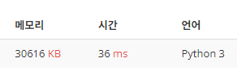

# [Silver IV] 괄호 - 9012 

[문제 링크](https://www.acmicpc.net/problem/9012) 

### 성능 요약

메모리: 31120 KB, 시간: 44 ms

### 분류

자료 구조, 스택, 문자열

### 제출 일자

2024년 3월 18일 15:46:44

### 문제 설명

<p>괄호 문자열(Parenthesis String, PS)은 두 개의 괄호 기호인 ‘(’ 와 ‘)’ 만으로 구성되어 있는 문자열이다. 그 중에서 괄호의 모양이 바르게 구성된 문자열을 올바른 괄호 문자열(Valid PS, VPS)이라고 부른다. 한 쌍의 괄호 기호로 된 “( )” 문자열은 기본 VPS 이라고 부른다. 만일 x 가 VPS 라면 이것을 하나의 괄호에 넣은 새로운 문자열 “(x)”도 VPS 가 된다. 그리고 두 VPS x 와 y를 접합(concatenation)시킨 새로운 문자열 xy도 VPS 가 된다. 예를 들어 “(())()”와 “((()))” 는 VPS 이지만 “(()(”, “(())()))” , 그리고 “(()” 는 모두 VPS 가 아닌 문자열이다. </p>

<p>여러분은 입력으로 주어진 괄호 문자열이 VPS 인지 아닌지를 판단해서 그 결과를 YES 와 NO 로 나타내어야 한다. </p>

### 입력 

 <p>입력 데이터는 표준 입력을 사용한다. 입력은 T개의 테스트 데이터로 주어진다. 입력의 첫 번째 줄에는 입력 데이터의 수를 나타내는 정수 T가 주어진다. 각 테스트 데이터의 첫째 줄에는 괄호 문자열이 한 줄에 주어진다. 하나의 괄호 문자열의 길이는 2 이상 50 이하이다. </p>

### 출력 

 <p>출력은 표준 출력을 사용한다. 만일 입력 괄호 문자열이 올바른 괄호 문자열(VPS)이면 “YES”, 아니면 “NO”를 한 줄에 하나씩 차례대로 출력해야 한다. </p>

### 코드
```PY
from sys import stdin as s
#s = open("input.txt")
N = int(s.readline())

for _ in range(N):
    stack = []
    VPN = 'YES'
    str = s.readline().strip()
    for w in str:
        if w == '(':
            stack.append(w)
        else:
            try:
                stack.pop()
            except IndexError:
                VPN = 'NO'
    #
    if stack: VPN = 'NO'
    print(VPN)
```


괄호의 아다리, 즉 열리고 닫히는 짝꿍이 맞으면 된다는 개념을 떠올리고 스택을 사용해 마지막에 스택을 검사하여 짝이 맞는지 안맞는지 판단하여 결과를 도출하였다. 

### 다른 방법
여기서 짝을 맞추는것을 스택을 이용해서 사용하였지만, 아래처럼 replace로 짝꿍 자체를 계속해서 지우면 된다는 아이디어가 충격적이였다.. 간단하고 강력해보인다.
```PY
import sys
input = sys.stdin.readline

for _ in range(int(input())):
    s = input().strip()
    while '()' in s:
        s = s.replace('()','')
    print('NO') if s else print('YES')
```
