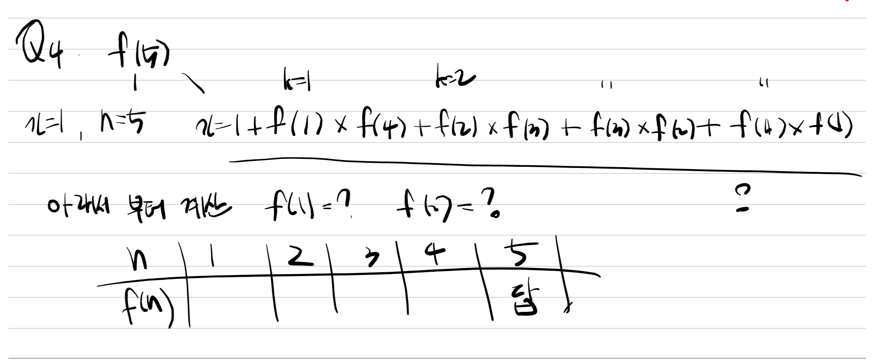

## Quiz 1
```cpp
Consider the following  C function

int f(int n)

{

    static int i = 1

    if (n>=5)return n;

    n = n+i;

    i++;

    return f(n);

}

the value returned by f(1) is
```


## Quiz 2

```cpp
Consider the following C-program

void foo (int n, int sum)

{

    int k = 0, j = 0;

    if (n = = 0) return;

    k = n % 10;

    j = n/10;

    sum = sum + k;

    foo (j, sum);

    printf(“%d”, k)

}

int main ()

{

    int a = 2048, sum = 0;

    foo (a, sum);

    printf(“%d\n”, sum);

}

What does the above program print?
```


## Quiz 3
```cpp
What is the return value of f(p, p), if the value of p is initialised to 5 before the call? Note that the first parameter is passed by reference, whereas the second parameter is passed by value. 

int f (int &x, int c) 

{

c = c — 1; 

if (c = = 0) return 1; 

x = x + 1; 

return f(x,c) * x;

}
```


## Quiz 4
```cpp
Consider the following C function. 

int fun (int n)

{ 

    int x=1, k; 

    if (n==1) return x; 

    for (k=1; k<n; ++k) 

    x=x + fun (k) * fun (n — k); 

    return x; 

}

The return value of fun (5) is
```



메모리제이션과 비슷한 원리로 f(1)처럼 낮은 숫자부터 결과값을 먼저 구하면 문제의 답을 찾을 수 있었다.