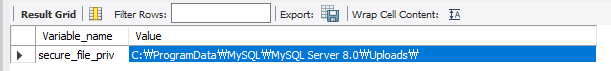

데이터베이스 스키마에 한글이 포함된 경우 데이터베이스와 CSV파일모두 UTF-8로 인코딩해야한다.

### 테이블 생성
```sql
CREATE TABLE Item (
    id BIGINT PRIMARY KEY,
    only BOOLEAN,
    ...
)
DEFAULT CHARACTER SET utf8mb4 -- UTF8 옵션 / mysql 8.x에선 utf8mb4로 할것을 권장
COLLATE utf8mb4_unicode_ci;
```
### .XLSX to .CSV
액셀 -> 내보내기 -> CSV로 저장  혹은 **다른 이름으로 저장**에서 해당옵션을 사용  


### CSV로드 SQL
```
LOAD DATA INFILE '/path/to/your/csv/file.csv'
INTO TABLE your_table_name
FIELDS TERMINATED BY ','
ENCLOSED BY '"'
LINES TERMINATED BY '\n'
IGNORE 1 LINES; -- 첫 번째 줄은 헤더이므로 무시합니다.
```

### ❗문제 발생
MYSQL 8.x버전 부터는 외부 import/export를 제한을 두어 안된다.  
`User Error Code: 1290. The MySQL server is running with the --secure-file-priv option so it cannot execute this statement`
해당 에러 코드를 살펴보면, --secure-file-priv 옵션에 따라 실행될 수 없다고 한다.

```
show variables like 'secure_file_priv';
```


### value 값에 따른 옵션
- "" : 모든 외부경로에 대한 접근 가능
- NULL : "" 접근 불가능
- {DIRECTORY} : 해당 디렉토리 경로에서 접근가능

옵션 변경을 할수도, 현재 value값에 정해진 경로에서 진행할 수도 있겠다.

### 해결
편하게 mysql측에서 제공한 경로에서 진행을 하였다.
해당 경로에 ITEM.CSV를 업로드하고 실행을 하였더니 잘 실행이 되는 모습을 볼 수 있었다.

## 추가적인 생각할 거리들
위까지 하였지만 다시 삽입이 실패하는 경우가 있다.  
MYSQL에 임포트시킬때 무조건 CSV파일을 로드할 수 있는것은 아니다. 몇가지 경우에 만족할때 가능한데,
생성한 테이블 구조와 CSV파일의 구조가 일치하면 위 로드 SQL문을 통해 정상적으로 임포트할 수 있겠지만 구조가 다르거나 변수 타입이 다르다면? 얘기가 달라진다.

나는 csv에서 boolean 값으로 true/false를 이용하는 반면, mysql은 tinyint를 boolean과 같은 용도를 사용하기에 매핑해주어야 할 필요가 있었다. 매핑 방법으로는 로드 SQL문 밑에 아래코드를 예시로 추가해주면 된다.

```
(@ID, @only, @cash)
SET
    ID = @ID,
    only = IF(@only = 'TRUE', 1, 0),
    cash = IF(@cash = 'TRUE', 1, 0),
```
조건문을 달아서 매핑을 해주는것이다. true이면 1을 false일시 0을..

또한 CSV에 빈칸이 알아서 NULL로 매핑해주지 않아 이 또한 매핑을 해주었다.
```
    reqSTR = IF(@reqSTR = '', NULL, @reqSTR),
    reqDEX = IF(@reqDEX = '', NULL, @reqDEX),
    reqINT = IF(@reqINT = '', NULL, @reqINT),
    reqLUK = IF(@reqLUK = '', NULL, @reqLUK),
    reqJob = IF(@reqJob = '', NULL, @reqJob),
```

잘들어간모습

