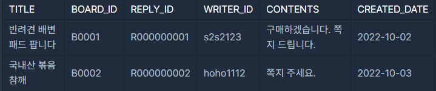

> **Level 1 / SELECT**  

### 문제 설명 & 요구사항

`USED_GOODS_BOARD` 테이블과 `USED_GOODS_REPLY` 테이블이 제공된다.  
이 두 테이블을 이용하여 **2022년 10월에 작성된 게시글**에 달린  
**댓글(reply)** 정보를 조회하는 문제이다.

조회 조건과 요구 사항은 다음과 같다:

1. 조회 대상 게시글은 **작성 날짜가 2022년 10월인 게시글(BOARD)** 이어야 한다.  

3. 출력해야 하는 컬럼:
   - 게시글 제목 (`TITLE`)
   - 게시글 ID (`BOARD_ID`)
   - 댓글 ID (`REPLY_ID`)
   - 댓글 작성자 ID (`WRITER_ID`)
   - 댓글 내용 (`CONTENTS`)
   - 댓글 작성 날짜 (`CREATED_DATE`)

4. 최종 결과 정렬 기준:
   - 댓글 작성 날짜 **오름차순(ASC)**
   - 동일 날짜라면 게시글 제목 **오름차순(ASC)**

---

### 테이블 구조

### USED_GOODS_BOARD

| 컬럼명        | 타입        | 설명                      |
|--------------|-------------|----------------------------|
| BOARD_ID     | VARCHAR     | 게시글 ID (PK)             |
| WRITER_ID    | VARCHAR     | 게시글 작성자 ID           |
| TITLE        | VARCHAR     | 제목                       |
| CONTENTS     | VARCHAR     | 내용                       |
| CREATED_DATE | DATE        | 작성 날짜                  |
| STATUS       | VARCHAR     | 거래 상태 ('SALE' 등)      |
| PRICE        | INTEGER     | 가격                       |

---

### USED_GOODS_REPLY

| 컬럼명        | 타입        | 설명                      |
|--------------|-------------|----------------------------|
| REPLY_ID     | VARCHAR     | 댓글 ID (PK)               |
| BOARD_ID     | VARCHAR     | 게시글 ID (FK)             |
| WRITER_ID    | VARCHAR     | 댓글 작성자 ID             |
| CONTENTS     | VARCHAR     | 댓글 내용                  |
| CREATED_DATE | DATE        | 댓글 작성 날짜             |

---

### 풀이
기본적으로 REPLY 테이블 정보를 출력하는데, 댓글이 달린 게시글의 제목도 필요한 상황이다. 
**이너조인을** 통해서 테이블을 조인시키고, WHERE 절을 통해 날짜 조건을 만족시킨다.
DATE 포맷이 고정적이여서 LIKE로 간단하게 조건을 만족시키고, 정렬 기준을 맞추어 해결한다.

### 처음 제출한 틀린 코드
```SQL
SELECT B.TITLE	,R.BOARD_ID,	R.REPLY_ID	,R.WRITER_ID	,R.CONTENTS,R.CREATED_DATE
from USED_GOODS_REPLY AS R
    JOIN
        USED_GOODS_BOARD AS B
    ON R.BOARD_ID = B.BOARD_ID
WHERE B.CREATED_DATE LIKE '2022-10-%'
ORDER BY R.CREATED_DATE ASC, B.TITLE ASC
```


### 정답 예시


설마 date 형식이 문제인가 싶어서 계속 수정을 했는데, 정확하게 예시처럼 나오지않았다.   
알고보니 mysql의 DATE_FORMAT 사용시.. 소문자 대문자도 구분이 있어서 `DATE_FORMAT(R.CREATED_DATE,'%Y-%m-%d')` 으로 작성하여 해결하였다.

### MYSQL 데이트 포맷
| 코드 | 의미         | 예시  |
|------|--------------|--------|
| %Y   | 연도(4자리)  | 2024   |
| %y   | 연도(2자리)  | 24     |
| %m   | 월(2자리)    | 03     |
| %c   | 월(0 제거)   | 3      |
| %d   | 일(2자리)    | 09     |
| %e   | 일(0 제거)   | 9      |
| %H   | 시(24h)      | 14     |
| %h   | 시(12h)      | 02     |
| %i   | 분           | 05     |
| %s   | 초           | 07     |

### 정답
```sql
-- 코드를 입력하세요
SELECT B.TITLE	,R.BOARD_ID,	R.REPLY_ID	,R.WRITER_ID	,R.CONTENTS, DATE_FORMAT(R.CREATED_DATE,'%Y-%m-%d') AS CREATED_DATE
from USED_GOODS_REPLY AS R
    JOIN
        USED_GOODS_BOARD AS B
    ON R.BOARD_ID = B.BOARD_ID
WHERE B.CREATED_DATE LIKE '2022-10-%'
ORDER BY R.CREATED_DATE ASC, B.TITLE ASC
```