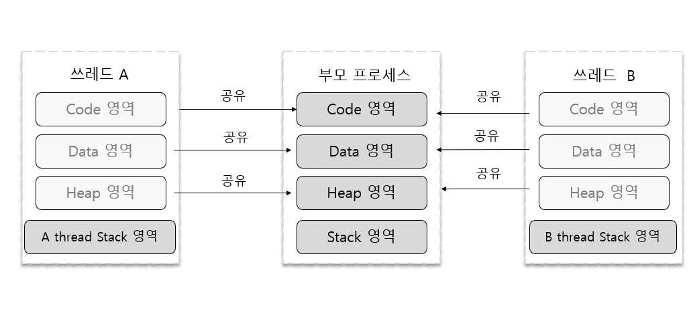
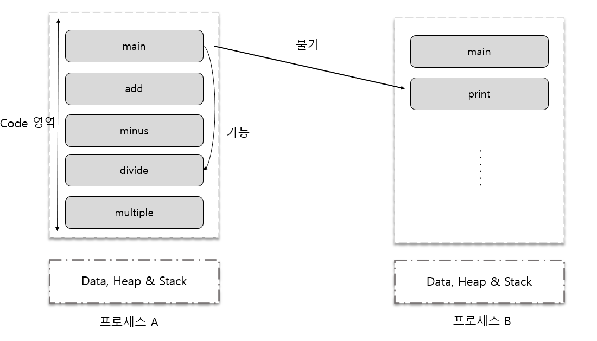
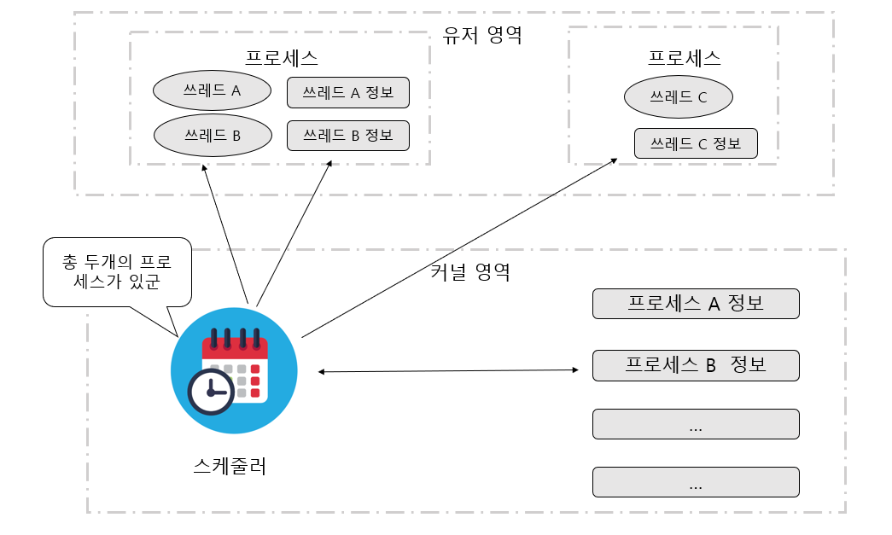

## 쓰레드란 무엇인가?
### 멀티 프로세스 기반 프로그램
두개의 서로 다른 프로그램이 실행되기 위해서 둘 이상의 프로세스를 생성하는것은 당연한 일이다.

그리고 하나의 프로그램이 두가지 이상의 일을 동시에 처리하기 위해서도 둘 이상의 프로세스가 필요하다.

### 멀티 프로세스 운영체제 기반 프로그램의 문제점과 새로운 제안
우리는 컨택스트 스위칭이 빈번할수록 시스템에 부담이 된단 사실을 앞서 배웠다.
만약 컨택스트 스위칭에 소요되는 시간을 줄인다면 성능 향상을 기대할 수 있을 것이다.

그 방법은 저장하고 복원하는 컨택스트 정보의 개수를 줄여주면 된다.

컨택스트 스위칭이 필요한 이유는 프로세스들이 완전히 독립되어 있기 때문이다.
A프로세스에서 B프로세스로 실행이 넘어갈때, CPU부터 메모리까지 100%로 B를 위해 완전히 자리를 내주어야 한다. 때문에 시간이 오래 걸리는 컨택스트 스위칭이 필요하게 된다.

### 해결책, 쓰레드
우리는 하나의 프로그램에서 둘 이상의 흐름이 있을때, 하나로 할지 둘로 할지 정해야한다. 둘로 간다면 앞서배웠던 프로세스를 생성할텐데, 이는 앞에서 문제들이 있었다. 그래서 쓰레드가 하나의 해결책인 것이다.

프로세스와 달리 쓰레드간에는 공유하는 상태 정보들이 있다. 이것이 컨택스트 스위칭을 빠르게 하는 요인이 된다.

- 쓰레드는 하나의 프로그램 내에서 여러 개의 실행 흐름을 두기 위한 모델이다.
- 쓰레드는 프로세스처럼 완벽히 독립적인 구조가 아니다. 쓰레드들 사이에는 공유하는 요소들이 있다.
- 쓰레드는 공유하는 요소가 있는 관계로 컨텍스트 스위칭에 걸리는 시간이 프로세스보다 짧다.

### 메모리 구조 관점에서 본 프로세스와 쓰레드

자식 프로세스 생성 후 메모리구조

자식 프로세스가 생성되고 난 다음에는 모든 것이 부모 프로세스와 독립적이다. 메모리 구조를 보면 생성 이후에는 아무런 관계가 없다.

쓰레드 생성 후 메모리 구조

쓰레드를 생성 시에 해당 쓰레드만을 위한 스택을 생성할뿐 그 나머지 영역은 부모 프로세스 영역을 공유하고 있다. (사실상 그냥 프로세스라고 표현하는 것이 맞다.)

- 쓰레드마다 스택을 독립적으로 할당해준다. -> 실행 흐름의 추가를 위한 최소 조건이 독립된 스택의 제공이다.
- 코드 영역을 공유한다.
    
    (프로세스의 경우 독립된 형태이기에 불가능하다.)
- 데이터 영역과 HEAP을 공유한다. -> 전역 변수와 malloc 함수를 통해서 동적할당된 메모리 공간은 공유가 가능하다.
    
    (A,B쓰레드 모두 같은 데이터와 힙 영역에 접근 가능. 따라서 IPC같은 복잡한 통신 기법은 필요X)

### Windows에서의 프로세스와 쓰레드
사실 Windows 운영체제에 있어서 프로세스는 상태(Running , Ready , Blocked) 를 지니지 않는다. 상태를 지니는 것은 프로세스가 아니라 쓰레드이다. (본체는 쓰레드!)

그렇다면 윈도우에서의 프로세스 컨택스트 스위칭은?
이는 서로 다른 프로세스 내에 존재하는 쓰레드들 사이에서 발생하는 컨텍스트 스위칭을 의미하는 것이다.

그렇다면 쓰레드를 생성하지 않는 프로세스는 어떠한 방식으로 실행이 될까? 윈도우에서 쓰레드가 존재 하지않는 프로그램은 없다. 프로세스 생성과 동시에 main함수를 호출해줄 쓰레드를 생성한다. 이러한 쓰레드를 가리켜 main 쓰레드라고 부르게 된다.

## 쓰레드 구현 모델에 따른 구분
### 커널 레벨(Kernel Level ) 쓰레드와 유저 레벨(User Level) 쓰레드
__첫 번째 경우로, 쓰레드를 생성해 주는 대상은 커널일 수 있다.__ 이러한 경우 운영체제가 제공하는 시스템 함수 호출을 통해서 쓰레드 생성을 요구해야 한다. 그러면 운영체제는 해당 쓰레드를 생성 및 관리하면서 새로운 흐름을 형성하도록 도와준다.

이렇듯 쓰레드를 생성 및 스케줄링하는 주체가 커널인 경우 __커널레벨 쓰레드__라고 한다.

그림의 위쪽부분인 **유저 영역**은 사용자에 의해 할당되는 메모리 공간을 의미한다.
코드 영역, 데이터, 스택 및 힙 영역 등등..

유저 영역을 제외한 영역을 **커널 영역**이라 한다. 운영 체제를 실행 시키기 위해서 필요한 메모리 공간이다.

__두 번째 경우로, 유저 레벨 쓰레드 모델이다.__ 멀티 프로세스 운영체제라 해서 커널이 기본적으로 쓰레드를 지원하는 것은 아니다.

쓰레드를 지원하지 않기에, 커널에 의존적이지 않은 형태로 쓰레드의 기능을 하는 라이브러리를 활용할 수 있는데, 이러한 방식으로 제공되는 것이 유저 레벨 쓰레드이다.

그렇기 때문에 운영체제는 쓰레드의 존재를 알지도 확인하지도 못한다!

### 커널 모드(Kernel Mode)와 유저 모드 (User Mode)
커널 영역은 유저 영역에 비해 상대적으로 중요하다. 메모리 참조 오류가 커널 영역에서 일어난다면 끔찍할 것이다.

그렇기 때문에 커널모드, 유저모드가 등장한다. 기본적으로 프로그램은 유저모드에서 동작하다. 윈도우 커널에서 동작이 실행될때 커널모드로의 전환이 일어난다. 커널 레벨 쓰레드 모델에서 스케줄링이 발생할때는 어떻게 될까??

커널에서 쓰레드 생성, 스케줄링을 담당하니 당연히 커널모드로 전환이 일어난다.
스케줄러는 커널의 일부이기 때문!

모드의 특징은 단순하다. 유저모드에서 동작할때 커널 영역으로 접근이 제한된다.
반대로 커널 모드에선 모든 영역에 접근이 가능하다.

그리고 모드의 전환은 시스템에 부담을 주는 일이라는 것도 기억해두자.

또한 모드를 제공하는 대상은 운영체제가 아닌 프로세서이다.

### 커널 레벨 쓰레드와 유저 레벨 쓰레드의 장점 및 단점
나온 내용을 살펴보면 커널 레벨 쓰레드가 좋아보이지만, 장단점이 존재한다.

커널 레벨 쓰레드는,
- 커널에서 제공하기에 안정성, 다양한 기능
- 쓰레드 사용시 커널 모드 전환이 필수이기에 전환이 빈번하며, 이는 성능의 저하.

유저 레벨 쓰레드는,
- 커널은 쓰레드의 존재를 모름. 전환이 필요없으니 성능이 좋다.
- 존재를 모르는 것이 오히려 단점이다. 하나의 프로세스의 A 쓰레드가 블로킹 되었을때 그에 속해있는 다른 쓰레드도 함께 블로킹된다. 커널 입장에선 하나의 프로세스니깐..

### 출처
윤성우,  ⌜뇌를 자극하는 윈도우즈 시스템 프로그래밍⌟, 한빛미디어, 2006  
유튜브, "한빛미디어", "뇌를 자극하는 윈도우즈 시스템 프로그래밍", https://www.youtube.com/watch?v=GVX-m3RF-K0&list=PLVsNizTWUw7E2KrfnsyEjTqo-6uKiQoxc
Github, "system_programming", https://github.com/connieya/system_programming